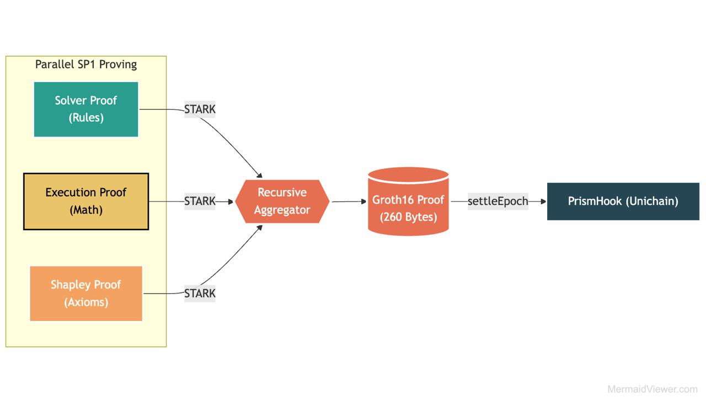
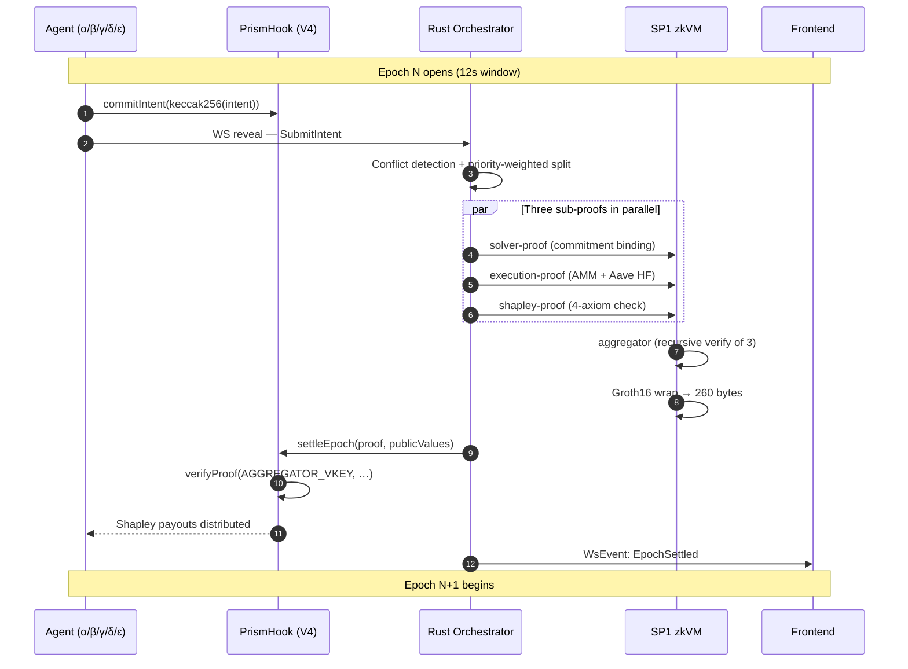
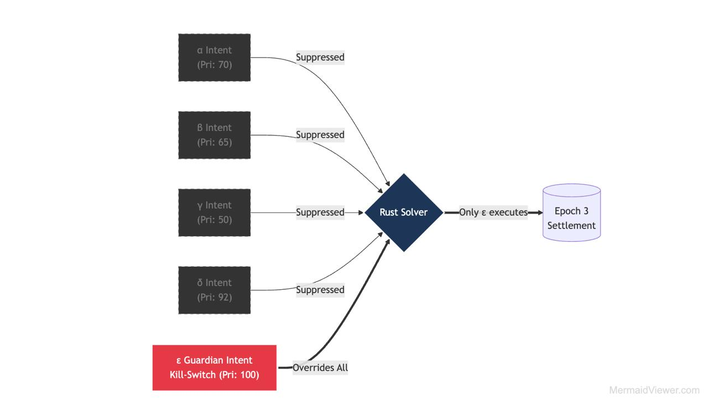

# PRISM


## Introduction

PRISM isn't just another MEV protection layer — it's a paradigm shift in how Uniswap V4 pools defend themselves. The future of DeFi holds a thousand specialized agents trading against your LPs. Today's V4 hooks aren't ready for them.

PRISM is a **ZK-proven cooperative MEV coordinator built as a Uniswap V4 hook**. Instead of the usual war of priority gas auctions, sandwich attacks, and toxic flow draining V4 LPs, PRISM lets a swarm of specialized agents *cooperate* inside the hook's commit-reveal window — and proves the cooperation was fair before a single token moves through `PoolManager`.

Five agents (α Predictive LP, β Fee Curator, γ Frag Healer, δ Symbiotic Backrunner, ε Cross-Protocol Guardian) commit signed intents to the V4 hook. A Rust orchestrator runs a conflict-resolving solver, generates four SP1 zkVM proofs (solver, execution, shapley, aggregator), recursively wraps them into a **260-byte Groth16**, and posts back to the hook. The hook verifies the proof and distributes **Shapley-fair** payouts on-chain — directly inside the V4 callback flow.

It's like Flashbots' transparency colliding head-on with Cooperative Game Theory's axioms, recursively folded inside a zkVM and stamped on a V4 hook — and the result is something that shouldn't fit in a 12-second epoch, but somehow, it does.

PRISM is the V4 hook where fairness doesn't just *exist* — it's **provable**.

> 📄 **Whitepaper foundation**: This implementation is grounded in [DAO-Agent: Zero Knowledge-Verified Incentives for Decentralized Multi-Agent Coordination](https://arxiv.org/abs/2512.20973) (Xia, Wang, Xu, Zhang — arXiv 2512.20973).

---

## Mathematical Visualization

### Recursive proof folding (1.2 MB → 260 bytes)



Three SP1 STARK proofs (Solver, Execution, Shapley) are generated in parallel, recursively aggregated, then wrapped in Groth16. The hook on Unichain only ever sees the final 260-byte proof.

### Worked Shapley split (3-agent simplified case)

For a coalition `{α, β, γ}` producing `v({α,β,γ}) = 100 bps`, the Shapley value `φᵢ` is the average marginal contribution across all permutations:

| Coalition `S` | `v(S)` |
|---|---|
| ∅ | 0 |
| {α} | 30 |
| {β} | 25 |
| {γ} | 20 |
| {α, β} | 60 |
| {α, γ} | 55 |
| {β, γ} | 50 |
| {α, β, γ} | 100 |

Resulting Shapley payouts (in basis points, summing to 10000):

| Agent | φᵢ | Share |
|---|---|---|
| α | 38.33 | 3833 bps |
| β | 33.33 | 3333 bps |
| γ | 28.33 | 2833 bps |
| **Sum** | **100.00** | **9999 bps** (rounding remainder → α) |

PRISM extends this to 5 agents (32 subsets) with priority weighting from on-chain capability flags. The full computation runs **inside** `shapley-proof.elf` — the on-chain hook only sees the final `uint16[5]`.

### Per-epoch lifecycle



---

## Meet the Five Agents

PRISM's swarm isn't five copies of the same brain — each agent is a **specialized strategy** with its own market view, action set, and on-chain capability flags. The Shapley split rewards each one's marginal contribution to the coalition's surplus.

### α — Predictive LP

> *"I anticipate where the price is going and stage liquidity before the swap arrives."*

Reads the live Uniswap public-API order book + recent swap deltas to predict short-horizon price drift, then proposes **`AddLiquidity` / `RemoveLiquidity`** intents around a concentrated tick range. α captures the LP fee that would otherwise be earned by a slower passive LP.

- **Action types**: `AddLiquidity`, `RemoveLiquidity`
- **Capabilities**: `canLP`
- **Brain**: [`agent-brains/alpha/brain.py`](./agent-brains/alpha/brain.py)

### β — Fee Curator

> *"I tune the dynamic fee in real time so LPs earn more during volatility without scaring off flow."*

Watches realized swap volatility and proposes a new dynamic fee via **`SetDynamicFee`**, bounded above by `LPFeeLibrary.MAX_LP_FEE`. β can also fire **`MigrateLiquidity`** to shift α's range when the pool re-prices. It's the only agent allowed to touch the fee parameter.

- **Action types**: `SetDynamicFee`, `MigrateLiquidity`
- **Capabilities**: `canLP`, `canSetFee`
- **Brain**: [`agent-brains/beta/brain.py`](./agent-brains/beta/brain.py)

### γ — Frag Healer

> *"I find scattered liquidity stuck in dead ticks and re-knit it into the active range."*

Scans on-chain LP positions for **fragmentation** — ticks far from the active range that no longer earn fees — and proposes **`BatchConsolidate`** intents to migrate them back. γ improves capital efficiency for the whole pool, and the resulting tighter spread is part of what δ later backruns.

- **Action types**: `BatchConsolidate`
- **Capabilities**: `canLP`
- **Brain**: [`agent-brains/gamma/brain.py`](./agent-brains/gamma/brain.py)

### δ — Symbiotic Backrunner

> *"I capture the arbitrage that β's fee migration creates — and share the upside with the LPs whose moves I exploited."*

Detects price-spread windows opened by α/β/γ activity and proposes **`Backrun`** intents. The "symbiotic" part: the Shapley solver attributes part of δ's profit back to whichever agents created the spread, so backrunning *funds* the LPs instead of bleeding them.

- **Action types**: `Backrun`
- **Capabilities**: `canSwap`, `canBackrun`
- **Brain**: [`agent-brains/delta/brain.py`](./agent-brains/delta/brain.py)

### ε — Cross-Protocol Guardian

> *"If anything in DeFi breaks, I hedge the pool and pull the kill-switch before the bad price hits."*

Monitors **Aave health-factor**, oracle deviations, and bridge status. On a risk signal, ε submits a priority-100 **`DeltaHedge`** / **`CrossProtocolHedge`** / **`KillSwitch`** intent that overrides all four other agents (see the Crisis Scenario diagram below). ε is the only agent with `canKillSwitch` — and the only one that can halt settlement mid-epoch.

- **Action types**: `DeltaHedge`, `CrossProtocolHedge`, `KillSwitch`
- **Capabilities**: `canHedge`, `canKillSwitch`
- **Brain**: [`agent-brains/epsilon/brain.py`](./agent-brains/epsilon/brain.py)

### Capability matrix

| Agent | `canLP` | `canSwap` | `canBackrun` | `canSetFee` | `canHedge` | `canKillSwitch` |
|---|:-:|:-:|:-:|:-:|:-:|:-:|
| α Predictive LP | ✓ | | | | | |
| β Fee Curator | ✓ | | | ✓ | | |
| γ Frag Healer | ✓ | | | | | |
| δ Symbiotic Backrunner | | ✓ | ✓ | | | |
| ε Cross-Protocol Guardian | | | | | ✓ | ✓ |

These flags are **enforced on-chain** in `PrismHook.agentCaps[agent]` — an intent that exceeds its agent's capability is rejected inside the `execution-proof` SP1 program before the proof can even be aggregated.

---

## Key Features

- **Five-Agent Cooperative Swarm**: Specialized brains (Predictive LP, Fee Curator, Frag Healer, Symbiotic Backrunner, Cross-Protocol Guardian) submit signed intents under per-agent capability flags — no single agent can speak outside its lane.
- **Commit-Reveal On-Chain**: Agents commit `keccak256(intent)` to the V4 hook *before* revealing — eliminates last-look games and front-running of the off-chain reveal channel.
- **Recursive ZK Proof Stack**: Four SP1 zkVM programs (solver / execution / shapley / aggregator) per epoch, recursively wrapped into a single ~260-byte Groth16 proof. The hook verifies *one* proof, not four.
- **Shapley-Fair Payouts**: Reward distribution is computed inside the zkVM as a priority-weighted Shapley value. Axiomatic fairness (efficiency, symmetry, dummy, additivity) is enforced by the proof, not by trust.
- **Plan-B Three-Proof Fallback**: If recursive Groth16 wrap exceeds the demo budget, the hook accepts the three sub-proofs separately via `settleEpochThreeProof` — graceful degradation without breaking the trust model.
- **HookMiner CREATE2 Deploy**: Hook address is salt-mined to encode the exact 6-flag permission set directly into the address — no off-chain registry needed.
- **Schema-Versioned Settlement**: A 1-byte schema version is prefixed to every public-values blob so future tuple extensions can't silently misalign Solidity decoding.
- **Capability Rotation + Kill-Switch**: Owner can `revokeAgent`, `updateAgentCaps`, `freezeSubVkeys`. The Guardian agent (ε) holds a dedicated `triggerKillSwitch` privilege.
- **Powered by SP1 + Uniswap V4 + Alloy**: Rust end-to-end on the prover side, Solidity on the hook side, typed Vite/React dashboard streaming live `WsEvent`s over WebSocket.

---
## Architecture & User Flow

### User Architecture


Vertical pipeline from off-chain agent intents (Python, JSON + keccak) through the Rust orchestrator's WebSocket server and conflict solver, into parallel SP1 STARK proving, recursively aggregated and Groth16-wrapped, finally landing on `PrismHook.sol` on Unichain — which calls the SP1 Verifier Gateway and atomically settles Shapley payouts.

### Agent Coordination Around the V4 Pool


Each agent has a specialized lane against the V4 pool, but they're not isolated — β's dynamic fee informs α's LP positioning, β's migration creates the spread γ batch-consolidates and δ arbitrage-backruns, and ε holds a cross-protocol hedge plus a priority-100 kill-switch that can override every other agent. The Shapley split rewards each agent's marginal contribution to this coordinated dance.

### Crisis Scenario — ε Guardian Override



When the ε Guardian observes a cross-protocol risk signal (Aave health-factor breach, oracle deviation, etc.), it submits a priority-100 kill-switch intent. Inside the Rust solver, that intent **overrides all four lower-priority intents** — α, β, γ, δ are all marked `Suppressed`, and only ε's hedge action lands in the settlement bundle. This is the §10.3 crisis walkthrough; the proof still validates Shapley axioms over the (one-agent) coalition, so the same hook accepts it without special-casing.

### User Flow

```mermaid
flowchart LR
    U(["User / LP / Trader"]) -->|"swap / add liquidity"| POOL["Uniswap V4 Pool"]
    POOL -->|"hook callback"| HOOK["PrismHook"]
    HOOK -->|"emits IntentWindowOpen"| AGENTS["5 Agents observe"]
    AGENTS -->|"1. commitIntent on-chain"| HOOK
    AGENTS -->|"2. reveal over WS"| ORCH["Rust Orchestrator"]
    ORCH -->|"3. solve + 4 proofs"| SP1["SP1 zkVM"]
    SP1 -->|"4. Groth16 (260B)"| HOOK
    HOOK -->|"5. verify + payouts"| AGENTS
    HOOK -->|"6. fair execution"| POOL
    POOL -->|"better fill"| U
    ORCH -.->|"live WsEvent"| DASH["Dashboard"]

    style U fill:#1e3a8a,stroke:#3b82f6,color:#dbeafe
    style HOOK fill:#14532d,stroke:#22c55e,color:#dcfce7
    style ORCH fill:#1e293b,stroke:#64748b,color:#e2e8f0
    style SP1 fill:#7c2d12,stroke:#f97316,color:#fef3c7
    style POOL fill:#581c87,stroke:#a855f7,color:#f3e8ff
    style AGENTS fill:#0f172a,stroke:#475569,color:#e2e8f0
    style DASH fill:#1e3a8a,stroke:#3b82f6,color:#dbeafe
```



---


## 🦄 How PRISM Uses Uniswap

PRISM is **built for Uniswap V4 from the ground up** — not a wrapper, not an aggregator, but a native V4 hook deployed on Unichain Sepolia. Every layer of the stack touches the V4 SDK or Uniswap infrastructure:

### 1. Uniswap Public API (live market data)

Every agent brain — and the Rust orchestrator itself — pulls real-time market data from Uniswap's public REST API. This is the *primary* feed driving every intent the swarm submits:

```rust
// crates/prism-orchestrator/src/main.rs
uniswap_api_url: std::env::var("UNISWAP_API_URL")
    .unwrap_or_else(|_| "https://api.uniswap.org".into()),
```

```python
# agent-brains/common/market_reader.py — UNISWAP_API_URL fallback
```

- **α (Predictive LP)** uses recent swap deltas + spot quotes to predict short-horizon price drift.
- **β (Fee Curator)** reads realized volatility off the same feed to decide when to nudge the dynamic fee.
- **γ (Frag Healer)** uses it to find fragmented liquidity worth re-knitting back to the active range.
- **δ (Symbiotic Backrunner)** detects the imbalance windows opened by α/β/γ activity.
- **ε (Guardian)** cross-references it against off-chain risk feeds to catch oracle deviations.

Without this API, the swarm has no market view — it's the layer that converts Uniswap state into actionable intents.

### 2. Native V4 Hook (`contracts/src/PrismHook.sol`)

PRISM is `IHooks`-compliant and inherits the full V4 hook lifecycle. We import directly from `v4-core`:

```solidity
import {IHooks} from "v4-core/src/interfaces/IHooks.sol";
import {IPoolManager} from "v4-core/src/interfaces/IPoolManager.sol";
import {PoolKey} from "v4-core/src/types/PoolKey.sol";
import {BalanceDelta} from "v4-core/src/types/BalanceDelta.sol";
import {BeforeSwapDelta} from "v4-core/src/types/BeforeSwapDelta.sol";
import {Hooks} from "v4-core/src/libraries/Hooks.sol";
import {LPFeeLibrary} from "v4-core/src/libraries/LPFeeLibrary.sol";
```

We implement **6 V4 hook callbacks** — exactly the six v2 §7.1 requires, mined into the address via HookMiner CREATE2:

| Callback | Used for |
|---|---|
| `beforeSwap` | Open the intent window, gate against the kill-switch |
| `afterSwap` | Settle realized MEV into the Shapley pot |
| `beforeAddLiquidity` / `afterAddLiquidity` | α (Predictive LP) and γ (Frag Healer) capability gates |
| `beforeRemoveLiquidity` / `afterRemoveLiquidity` | LP-removal symmetry checks |

### 3. PoolManager Integration

`PrismHook` declares an immutable reference to V4's `IPoolManager`, set in the constructor and frozen for the contract's lifetime:

```solidity
// contracts/src/PrismHook.sol
IPoolManager public immutable poolManager;

constructor(IPoolManager _poolManager, ...) {
    poolManager = _poolManager;
    // ...
}

modifier onlyPoolManager() {
    if (msg.sender != address(poolManager)) revert NotPoolManager();
    _;
}
```

The deploy script (`contracts/script/DeployPrismHook.s.sol`) wires this to Unichain Sepolia's canonical PoolManager at `0x00B036B58a818B1BC34d502D3fE730Db729e62AC`. Every V4 callback on the hook is gated by `onlyPoolManager` — no off-chain entity can spoof a V4 callback into our hook.

### 4. Dynamic Fees via `LPFeeLibrary` (β agent)

The β Fee Curator agent's `MigrateLiquidity` action lets it propose a new dynamic fee. We bound it with V4's canonical `LPFeeLibrary`:

```solidity
require(newFee <= LPFeeLibrary.MAX_LP_FEE, "Fee exceeds max");
```

This is the same library `PoolManager.updateDynamicLPFee` uses — β literally cannot push a fee past V4's hard cap.

### 5. Canonical V4 PoolKey Encoding (Python agents)

The five agent brains derive `PoolId` exactly the way V4 does, in Python via `eth_abi`:

```python
# agent-brains/common/market_reader.py
pool_id = keccak256(
    eth_abi.encode(
        ["address","address","uint24","int24","address"],
        (currency0, currency1, fee, tick_spacing, hooks_address),
    )
)
```

This matches V4's `Hooks.getPoolKeyHash` byte-for-byte — agents can correlate their off-chain market view with on-chain pool state without trusting an indexer.

### 6. HookMiner CREATE2 Salt Mining

V4 encodes hook permissions as flags in the **address itself**. PRISM uses the canonical `HookMiner` from V4-periphery to salt-mine an address that satisfies exactly the 6 v2 §7.1 flags:

```
0x0B9Ae4690F8b6EAbB1511a6e1C64C948b9edCFC0
                                        ^^^^
                                        last 14 bits encode hook flags
```

The deploy script (`contracts/script/DeployPrismHook.s.sol`) re-mines this salt automatically whenever bytecode changes — no off-chain registry, no trusted setup, just CREATE2.

### 7. Built on Unichain (Uniswap's L2)

We chose **Unichain Sepolia** (chain `1301`) deliberately — it's the Uniswap-native L2, and shipping there demonstrates that PRISM works in the environment the Foundation cares about most. Both production and demo hooks are live and verified.

---

## Mathematical Foundation

### The PRISM Model

PRISM is built on three intersecting foundations: **cooperative game theory** for payout fairness, **zero-knowledge recursive proofs** for trust-minimization, and **Uniswap V4's hook architecture** for in-protocol enforcement.

### Core Concepts

**1. Shapley Value Distribution**

Each agent's payout share for an epoch is the priority-weighted Shapley value over the coalition's total surplus:

```
φᵢ(v) = Σ_{S ⊆ N\{i}} [ |S|! · (n-|S|-1)! / n! ] · ( v(S ∪ {i}) − v(S) )
```

The four classical axioms — **efficiency**, **symmetry**, **dummy**, and **additivity** — are checked *inside* the `shapley-proof` SP1 program. The on-chain hook only sees the final `uint16[]` payout vector and verifies one Groth16 proof.

PRISM applies a **priority weighting** layer: each agent's marginal contribution is scaled by its `capability flag` priority, so β's `canSetFee` action and δ's `canBackrun` action are not treated as fungible. The result is still a Shapley distribution under the modified characteristic function `v'`.

Payouts are emitted as a `uint16[]` in basis points summing to `10000`. The hook reverts with `PayoutAgentMismatch` if the array length disagrees with the on-chain `agentList.length`.

**2. Recursive SP1 Aggregation**

Four ELFs are built independently:

| ELF | What it proves |
|---|---|
| `solver-proof` | commitment binding + intent ordering invariants |
| `execution-proof` | AMM math + Aave health-factor check + per-action capability validation |
| `shapley-proof` | priority-weighted Shapley split + 4-axiom validation |
| `aggregator` | recursive verification of the above three + Groth16 wrap input |

Sub-program ELFs (solver / execution / shapley) can rotate **without** rotating the aggregator vkey — the aggregator reads sub-vkeys via stdin. Only an aggregator-program change forces a hook redeploy.

**3. Commit-Reveal With On-Chain Binding**

```
agent → commitIntent(keccak256(abi.encode(epoch, agent, action_disc, payload)))
agent → WS reveal of full intent
orchestrator → solver-proof verifies every revealed intent matches an on-chain commitment
```

A reveal that doesn't match a commitment is dropped *inside the zkVM* — there is no off-chain trust window where the orchestrator could choose to ignore an inconvenient intent.

**4. HookMiner CREATE2 Salt Mining**

Uniswap V4 encodes hook permissions as flags in the **address itself** (lower 14 bits of the address must match the `getHookPermissions()` bitmap). PRISM mines a CREATE2 salt offline so the deployed address satisfies exactly the 6 hook flags — no more, no less.

```solidity
// 6 flags active: beforeSwap | afterSwap | beforeAddLiquidity | afterAddLiquidity
//                 | beforeRemoveLiquidity | afterRemoveLiquidity
// Mask = 0x3FFF, mined permission set
```

**5. Schema-Versioned Public Values**

Every `publicValues` blob submitted to `settleEpoch` is prefixed with a 1-byte `SCHEMA_VERSION`. The hook unwraps the byte, asserts it matches `SCHEMA_VERSION = 1`, then ABI-decodes the inner `(uint256 epoch, uint16[] payouts)`. Future tuple extensions get a new version byte; old proofs keep working until the hook is redeployed.

**6. Plan-B Three-Proof Settlement**

When recursive Groth16 wrap exceeds the demo budget (Succinct's prover network can intermittently spike past the 12s epoch budget), the orchestrator falls back to submitting the three sub-proofs separately:

```solidity
function settleEpochThreeProof(
  bytes solverProof,    bytes solverPv,
  bytes executionProof, bytes executionPv,
  bytes shapleyProof,   bytes shapleyPv
) external onlyOperator nonReentrant
```

Each sub-proof is verified against its own vkey (set once via `setSubVkeys`, then `freezeSubVkeys` for production). The shapley sub-proof's public values carry the canonical `(epoch, payouts)` pair — the hook still distributes Shapley-fair, the wrapping is just unbundled.

---

## Contract Addresses

Network: **Unichain Sepolia** (chain ID `1301`, RPC `https://sepolia.unichain.org`, explorer `https://sepolia.uniscan.xyz/`).

| Contract | Address |
|---|---|
| **PrismHook (production)** | `0x0B9Ae4690F8b6EAbB1511a6e1C64C948b9edCFC0` |
| **PrismHook (demo)** | `0xc64E1F5AB1B13B6E8D2E8e8e579E087c52054fC0` |
| **MockAave (production)** | `0x0Db03E7Dbce6139EbFB4af56a0625996D5f5b2Ee` |
| **MockAave (demo)** | `0x2f8F570b77e550B628296d461dCEb59a3d7De9d5` |
| **MockSP1Verifier (demo)** | `0x3B9590eE77eCef5933F3c689E7F92B0Ec70883A1` |
| **SP1VerifierGateway** | `0xeC95E0b24A0475b9afCAFD609b4D51D001380e75` |
| **PoolManager (Uniswap V4)** | `0x00B036B58a818B1BC34d502D3fE730Db729e62AC` |

**AGGREGATOR_VKEY**: `0x00bfb7e054593ffe30bb29c986846bb01ad352b90f3a0fe15a7e0152efcff512`

### Registered agents

| Agent | EOA | Capabilities |
|---|---|---|
| α Predictive LP | `0xf2E96F75…1EFF` | `canLP` |
| β Fee Curator | `0x9E8C1Bc1…BC59` | `canLP`, `canSetFee` |
| γ Frag Healer | `0xd01F4f01…f22D` | `canLP` |
| δ Symbiotic Backrunner | `0x0bfF21FB…F459` | `canSwap`, `canBackrun` |
| ε Cross-Protocol Guardian | `0x932aE7e2…BAB5` | `canHedge`, `canKillSwitch` |

---

## 🚀 Quick Start

### Prerequisites

- [Foundry](https://book.getfoundry.sh/) (`forge`, `cast`)
- [Rust toolchain](https://rustup.rs/) (stable, pinned via `rust-toolchain.toml`)
- [SP1 toolchain](https://docs.succinct.xyz/) (`cargo prove`, commit `563ede1`)
- Node.js 18+ (for the frontend)
- Python 3.10+ (for the agent swarm)

### Installation

```bash
# Clone the repository (with submodules — frontend is a submodule)
git clone --recursive https://github.com/pranav7002/Prism.git
cd Prism

# If you forgot --recursive
git submodule update --init --recursive

# Build SP1 ELFs (one-time, ~3-5 min)
make rebuild-elfs
make verify-elf            # SHA256 against ELF_SHAS.txt

# Build the Rust workspace
cargo build --release --workspace

# Build the Foundry contracts
cd contracts && forge build && cd ..
```

### Run the demo (4 terminals)

**Terminal 1 — Rust orchestrator**

```bash
USE_MOCK_PROVER=true \
USE_MOCK_INTENTS=false \
WS_BIND_ADDR=0.0.0.0:8765 \
cargo run --release -p prism-orchestrator
```

**Terminal 2 — Python agent swarm**

```bash
cd agent-brains
pip install -r requirements.txt
PYTHONPATH=. python run_swarm.py --live --epochs 1 2 3 --commit-on-chain
```

**Terminal 3 — Frontend dashboard**

```bash
cd frontend
npm install
cp .env.example .env
npm run dev
# Open http://localhost:5173/epoch/live
```

**Terminal 4 — On-chain transaction watcher (optional)**

```bash
cast logs --address 0xc64E1F5AB1B13B6E8D2E8e8e579E087c52054fC0 \
  --rpc-url https://sepolia.unichain.org -f
```

### Deploy your own PrismHook

```bash
cd contracts
USE_MOCK_VERIFIER=false \
AGGREGATOR_VKEY=$(cat ../AGGREGATOR_VKEY.txt) \
SP1_GATEWAY_ADDRESS=0xeC95E0b24A0475b9afCAFD609b4D51D001380e75 \
POOL_MANAGER=0x00B036B58a818B1BC34d502D3fE730Db729e62AC \
PRIVATE_KEY=$DEPLOYER_PRIVATE_KEY \
forge script script/DeployPrismHook.s.sol \
  --rpc-url https://sepolia.unichain.org --broadcast
```

The `HookMiner` library re-mines the CREATE2 salt automatically whenever bytecode changes.

### Frontend installation (standalone)

The frontend lives at `frontend/` (mounted as a git submodule).

```bash
cd frontend
npm install
npm run dev
```

#### Environment variables

Copy `.env.example` to `.env`:

```env
VITE_WS_URL=ws://localhost:8765
VITE_PRISM_HOOK_ADDRESS=0x0B9Ae4690F8b6EAbB1511a6e1C64C948b9edCFC0
VITE_RPC_URL=https://sepolia.unichain.org
VITE_CHAIN_ID=1301
```

All contract addresses are pre-configured for Unichain Sepolia.

---

## How to test

```bash
# Rust workspace (55 tests)
cargo test --workspace

# Foundry (32 tests)
cd contracts && forge test && cd ..

# Python agent swarm (69 + 1 skipped)
cd agent-brains && PYTHONPATH=. pytest && cd ..

# Frontend Vitest (23 tests)
cd frontend && npm test && cd ..
```

| Suite | Result |
|---|---|
| Rust workspace | **55 / 55** passing |
| Foundry | **32 / 32** passing |
| Python | **69 / 70** passing, 1 skipped (live-RPC) |
| Frontend (Vitest) | **23 / 23** passing |
| **Total** | **179 / 180** passing across 4 languages |

---

## Demo Video

A walkthrough video of PRISM running end-to-end (orchestrator + agent swarm + frontend + on-chain settlement on Unichain Sepolia) is recorded and pending upload.

**In the meantime, the live dashboard is the best way to see PRISM in motion:**

> 🌐 **[prism-ochre-five.vercel.app](https://prism-ochre-five.vercel.app/)**

It runs in DEMO mode by default — judges land on a self-contained loop that cycles through the full epoch lifecycle (intent collection → proof pipeline → Shapley payout → on-chain settlement) without needing to spin up the local stack. Flip to LIVE mode if you have a local orchestrator running.

_(YouTube link will be added here once the video is published.)_

---

## Whitepaper Reference

This implementation is grounded in the **DAO-Agent** framework, which provides the cryptographic and game-theoretic foundation for ZK-verified Shapley payouts in multi-agent coordination systems.

> 📄 **[DAO-Agent: Zero Knowledge-Verified Incentives for Decentralized Multi-Agent Coordination](https://arxiv.org/abs/2512.20973)**
> Yihan Xia, Taotao Wang, Wenxin Xu, Shengli Zhang — arXiv 2512.20973

- 🔗 Abstract: <https://arxiv.org/abs/2512.20973>
- 📖 HTML: <https://arxiv.org/html/2512.20973>
- 📥 PDF: <https://arxiv.org/pdf/2512.20973>

### Key concepts adopted from the whitepaper

- **Off-chain Shapley computation**: PRISM computes the priority-weighted Shapley value off-chain inside `shapley-proof.elf`, reducing on-chain gas by ~99% versus naive in-EVM Shapley.
- **Recursive STARK → Groth16 wrap**: The four-stage proof tree (`solver` / `execution` / `shapley` / `aggregator`) follows the paper's recursive aggregation pattern, ending in a constant-size Groth16 proof.
- **Honest participation as weakly dominant**: Agent capability flags + commit-reveal binding mean any deviation from honest reporting is provably detected inside the zkVM and slashed via reduced Shapley share.

PRISM extends the DAO-Agent framework with a **Uniswap V4 hook integration**, **HookMiner CREATE2 permission encoding**, and a **Plan-B fallback** that gracefully degrades from recursive aggregation to three separate sub-proof verifications when the recursion budget is exceeded.

---

## Development Team

- [@Sarnav07](https://github.com/Sarnav07)
- [@pranav7002](https://github.com/pranav7002)
- [@vihaan1016](https://github.com/vihaan1016)

---

## License

This project is licensed under the MIT License — see [`LICENSE`](./LICENSE).

---

**Built with ❤️ by the PRISM team — fairness, proven.**
