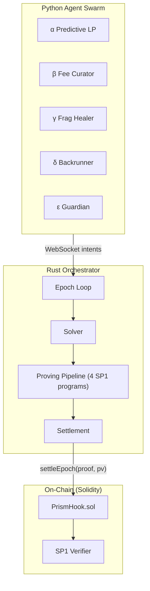
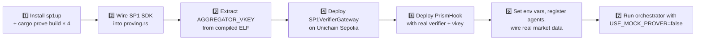

# PRISM Codebase Analysis — Status, Mocks, and ZK Integration Roadmap

## Architecture Overview



---

## ✅ What Is Completed

| Component | File(s) | Status |
|---|---|---|
| **PrismHook V4 contract** | [PrismHook.sol](file:///home/vihaan-jain/prism-private/contracts/src/PrismHook.sol) | ✅ Full V4 hook with all callbacks, agent registration, commitment/reveal, dynamic fee, kill-switch, ZK-verified `settleEpoch()` |
| **MockAave** | [MockAave.sol](file:///home/vihaan-jain/prism-private/contracts/src/MockAave.sol) | ✅ Minimal borrow/repay for ε's cross-protocol hedge |
| **Shared types** | [prism-types/lib.rs](file:///home/vihaan-jain/prism-private/crates/prism-types/src/lib.rs) | ✅ 1161 lines — [AgentIntent](file:///home/vihaan-jain/prism-private/crates/prism-types/src/lib.rs#242-252), [Action](file:///home/vihaan-jain/prism-private/agent-brains/common/schemas.py#49-72) (10 variants), [ExecutionPlan](file:///home/vihaan-jain/prism-private/sp1-programs/shapley-proof/src/main.rs#117-123), [ProtocolState](file:///home/vihaan-jain/prism-private/sp1-programs/execution-proof/src/main.rs#119-129), `WsEvent`, wire format [AgentIntentWire](file:///home/vihaan-jain/prism-private/agent-brains/common/schemas.py#253-303) with full hex↔bytes conversions |
| **Solver** | [prism-solver/lib.rs](file:///home/vihaan-jain/prism-private/crates/prism-solver/src/lib.rs) | ✅ Conflict detection, priority resolution, β-before-δ rule, kill-switch monitoring, **real Monte Carlo Shapley** (1000 samples, LCG PRNG), comprehensive tests |
| **Orchestrator core** | [main.rs](file:///home/vihaan-jain/prism-private/crates/prism-orchestrator/src/main.rs) | ✅ Epoch loop, WebSocket server, bidirectional agent intent ingestion, broadcast channel, mock/live intent routing |
| **Mock intent generator** | [mock_intents.rs](file:///home/vihaan-jain/prism-private/crates/prism-orchestrator/src/mock_intents.rs) | ✅ 3-scenario deterministic demo (calm/opportunity/crisis) |
| **Proving pipeline structure** | [proving.rs](file:///home/vihaan-jain/prism-private/crates/prism-orchestrator/src/proving.rs) | ✅ Parallel 3-proof + aggregation architecture, ABI-encoding `publicValues`, mock prover path |
| **Settlement module** | [settlement.rs](file:///home/vihaan-jain/prism-private/crates/prism-orchestrator/src/settlement.rs) | ✅ On-chain tx via `cast send`, env-var config, tx hash parsing |
| **Uniswap client** | [uniswap_client.rs](file:///home/vihaan-jain/prism-private/crates/prism-orchestrator/src/uniswap_client.rs) | ✅ Real [UniswapClient](file:///home/vihaan-jain/prism-private/crates/prism-orchestrator/src/uniswap_client.rs#19-23) with [get_pool_state](file:///home/vihaan-jain/prism-private/agent-brains/common/market_reader.py#318-329), [get_swap_quote](file:///home/vihaan-jain/prism-private/crates/prism-orchestrator/src/uniswap_client.rs#218-225), [get_lp_positions](file:///home/vihaan-jain/prism-private/agent-brains/common/market_reader.py#129-139) via REST; mock client for dev |
| **SP1 solver-proof** | [solver-proof/main.rs](file:///home/vihaan-jain/prism-private/sp1-programs/solver-proof/src/main.rs) | ✅ Complete circuit: commitment binding, no-fabrication, priority ordering, kill-switch-first, backrun safety |
| **SP1 execution-proof** | [execution-proof/main.rs](file:///home/vihaan-jain/prism-private/sp1-programs/execution-proof/src/main.rs) | ✅ Complete circuit: AMM constant-product validation, health factor check, volatility guard, migrate/consolidate/hedge constraints |
| **SP1 shapley-proof** | [shapley-proof/main.rs](file:///home/vihaan-jain/prism-private/sp1-programs/shapley-proof/src/main.rs) | ✅ Complete circuit: Monte Carlo Shapley with LCG PRNG (identical to off-chain), efficiency/non-negativity/symmetry axioms |
| **SP1 aggregator** | [aggregator/main.rs](file:///home/vihaan-jain/prism-private/sp1-programs/aggregator/src/main.rs) | ✅ Complete circuit: recursive sub-proof verification, cross-consistency epoch binding, final settlement hash |
| **Python agents α-ε** | [agent-brains/](file:///home/vihaan-jain/prism-private/agent-brains/) | ✅ All 5 brains with [decide(epoch)](file:///home/vihaan-jain/prism-private/agent-brains/alpha/brain.py#74-93), Pydantic-validated wire format, keccak commitment, offline/live broadcaster |
| **WebSocket broadcaster** | [broadcaster.py](file:///home/vihaan-jain/prism-private/agent-brains/common/broadcaster.py) | ✅ Live WS + offline mode, reconnect with exponential backoff |
| **Market reader** | [market_reader.py](file:///home/vihaan-jain/prism-private/agent-brains/common/market_reader.py) | ✅ [OnChainMarketReader](file:///home/vihaan-jain/prism-private/agent-brains/common/market_reader.py#160-393) with real [eth_call](file:///home/vihaan-jain/prism-private/agent-brains/common/market_reader.py#185-212) to Unichain RPC + mock fallback |
| **Commitment module** | [commitment.py](file:///home/vihaan-jain/prism-private/agent-brains/common/commitment.py) | ✅ Python-side keccak matching Rust `AgentIntent::compute_commitment` |
| **Tests** | `contracts/test/`, `agent-brains/tests/` | ✅ Foundry tests for hook + ABI compat; Python tests for all brains, broadcaster, commitment, market reader, swarm |

---

## 🔶 What Is Being Mocked

| Mock | Where | What It Replaces |
|---|---|---|
| **MockSP1Verifier** | [MockSP1Verifier.sol](file:///home/vihaan-jain/prism-private/contracts/src/MockSP1Verifier.sol) | Always-pass `verifyProof()` — accepts any proof bytes without actual cryptographic verification |
| **Mock Prover** | [proving.rs L142-159](file:///home/vihaan-jain/prism-private/crates/prism-orchestrator/src/proving.rs#L142-L159) | Returns SHA-256-derived 128-byte fake proofs instead of running SP1 Groth16. Default mode (`USE_MOCK_PROVER=true`) |
| **Mock ELF Stubs** | [proving.rs L31-38](file:///home/vihaan-jain/prism-private/crates/prism-orchestrator/src/proving.rs#L31-L38) | `mock-elf` feature flag sets `SOLVER_ELF`, `EXECUTION_ELF`, `SHAPLEY_ELF`, `AGGREGATOR_ELF` to empty `&[]` |
| **Mock Settlement** | [main.rs L242-244](file:///home/vihaan-jain/prism-private/crates/prism-orchestrator/src/main.rs#L242-L244) | When env vars missing, generates fake `0x...` tx hashes via SHA-256 instead of submitting on-chain |
| **MockUniswapClient** | [uniswap_client.rs L201-235](file:///home/vihaan-jain/prism-private/crates/prism-orchestrator/src/uniswap_client.rs#L201-L235) | Hardcoded pool state (tick=200000, liq=1.5e15, fee=3000) — used in epoch loop. Real `UniswapClient` exists but is `#[allow(dead_code)]` |
| **MockMarketReader** | [market_reader.py L99-138](file:///home/vihaan-jain/prism-private/agent-brains/common/market_reader.py#L99-L138) | Python-side hardcoded pool state matching Rust mock. `AlphaBrain` explicitly sets `use_mock=True` |
| **MockAave** | [MockAave.sol](file:///home/vihaan-jain/prism-private/contracts/src/MockAave.sol) | No collateral checks, no interest — placeholder for ε's cross-protocol delta hedge |
| **Mock Intent Fallback** | [main.rs L193-199](file:///home/vihaan-jain/prism-private/crates/prism-orchestrator/src/main.rs#L193-L199) | When no live WebSocket intents are received, orchestrator generates deterministic mock intents |

---

## ❌ What Is Left for Integration

### 1. SP1 ELF Compilation ✅ DONE

All 4 SP1 programs compiled to RISC-V ELFs against the SP1 v3.4.0 toolchain (matches the `sp1-sdk = "3.4"` we depend on).

```
sp1-programs/solver-proof/elf/riscv32im-succinct-zkvm-elf      263,556 bytes
sp1-programs/execution-proof/elf/riscv32im-succinct-zkvm-elf   239,468 bytes
sp1-programs/shapley-proof/elf/riscv32im-succinct-zkvm-elf     234,872 bytes
sp1-programs/aggregator/elf/riscv32im-succinct-zkvm-elf        175,384 bytes
```

Build steps (for reference):
```bash
~/.sp1/bin/sp1up -v v3.4.0          # pin toolchain to SDK-compatible version
for prog in solver-proof execution-proof shapley-proof aggregator; do
  (cd sp1-programs/$prog && cargo prove build)
done
```

### 2. Real Proving Pipeline ✅ DONE

[proving.rs](crates/prism-orchestrator/src/proving.rs) now has a `RealProver` struct (gated behind the `real-prover` cargo feature) that caches `(pk, vk)` pairs from `ProverClient::new().setup(ELF)` and runs the real pipeline:

- 3 sub-proofs (solver / execution / shapley) generate **compressed** SP1 proofs in parallel
- `prove_epoch` chains them into the aggregator via `SP1Stdin::write_proof(proof, vk.vk.clone())`
- Aggregator runs `.groth16().run()` to produce the on-chain-verifiable proof
- `prove_epoch` signature now takes an `Option<Arc<RealProver>>` plus the live `HealthFactor`

### 3. Deploy Real SP1 Verifier On-chain 🟡 PREPARED (deploy pending)

- New script [DeployVerifier.s.sol](contracts/script/DeployVerifier.s.sol) deploys `SP1VerifierGateway` + `SP1VerifierGroth16` v3.0.0 and registers the Groth16 route via `addRoute()`.
- [DeployPrismHook.s.sol](contracts/script/DeployPrismHook.s.sol) refactored to read `SP1_GATEWAY_ADDRESS` from env, with a `USE_MOCK_VERIFIER=true` fallback for local Anvil tests.
- `AGGREGATOR_VKEY` extracted from the compiled aggregator ELF and saved to [AGGREGATOR_VKEY.txt](AGGREGATOR_VKEY.txt):

  ```
  0x0071dbaffa0632707d8274ee31d554d9d233f8373c49eb4fb7970607e2c39a52
  ```

  (Rotated from the original `0x00b71420…cfa4b6` after the C2 audit fix —
  the aggregator program was rewritten to commit Solidity-ABI public values
  directly, which changes the ELF and therefore the vkey.)

  Extracted via the new example: `cargo run --release --example extract_aggregator_vkey --features real-prover -p prism-orchestrator`.

The actual on-chain deploy (Unichain Sepolia) is deferred — settlement falls back to mock SHA-256 tx hashes when `PRISM_HOOK_ADDRESS` / `PRIVATE_KEY` / `UNICHAIN_RPC_URL` are unset.

### 4. Wire Real Uniswap Client into Epoch Loop ✅ DONE

`main.rs` now uses real `UniswapClient::new(&config.uniswap_api_url)` for steady-state pool reads, with a `MockUniswapClient` cold-start fallback so the orchestrator never deadlocks at boot (e.g. if `api.uniswap.org` rate-limits the very first request).

A new [aave_client.rs](crates/prism-orchestrator/src/aave_client.rs) issues real `eth_call` to Aave V3's `Pool.getUserAccountData(address)` (selector `0xbf92857c`), parses the 6×32-byte return, and descales by 1e8 to populate `HealthFactor`. Falls back to `HF=2.0 (healthy)` when `AAVE_*` env vars are unset.

### 5. Wire Python Agents to Real Market Data (🟡 Medium)

Every agent brain hard-codes `use_mock=True`:
```python
self.market = get_market_reader(use_mock=True)  # alpha/brain.py L71
```

**Fix**: Set `UNICHAIN_RPC_URL` env var and remove `use_mock=True` to activate `OnChainMarketReader`.

### 6. Deploy and Configure PrismHook (🟡 Medium)

- Deploy `PrismHook` on Unichain Sepolia using the deploy script: [DeployPrismHook.s.sol](file:///home/vihaan-jain/prism-private/contracts/script/DeployPrismHook.s.sol)
- Set env vars: `PRISM_HOOK_ADDRESS`, `PRIVATE_KEY`, `UNICHAIN_RPC_URL`
- Register all 5 agent wallets with capabilities via `registerAgent()`

### 7. End-to-End Data Flow Gaps (🟡 Medium)

- Solver's `HealthFactor` is never populated from real data — currently only used in `KillSwitchMonitor::should_trigger()` and the execution-proof circuit requires it as input
- `volatility_30d_bps` is hardcoded to `1500` even in `OnChainMarketReader` — needs an oracle or historical data source
- LP positions in `OnChainMarketReader.get_lp_positions()` returns mock data — needs a subgraph or indexer

---

## 🛣 Roadmap: Steps to Generate Real ZK Proofs



### Step-by-step:

1. **Install SP1 toolchain**: `curl -L https://sp1up.succinct.xyz | bash && sp1up`
2. **Compile all 4 ELFs**: `cargo prove build` in each `sp1-programs/*/` directory
3. **Remove `mock-elf` feature**: Build orchestrator with `--no-default-features` so `include_bytes!()` loads real ELFs
4. **Wire SP1 SDK in `proving.rs`**: Replace mock fallback in `run_with_progress()` and `run_aggregator_real()` with actual `sp1_sdk::ProverClient` calls
5. **Extract vkey**: `ProverClient::from_env().setup(AGGREGATOR_ELF).1.bytes32()` → save to `AGGREGATOR_VKEY.txt`
6. **Deploy verifier**: Deploy Succinct's `SP1VerifierGateway` on Unichain Sepolia (or use their pre-deployed gateway if available)
7. **Deploy PrismHook** with real verifier address and aggregator vkey
8. **Set env vars**: `PRISM_HOOK_ADDRESS`, `PRIVATE_KEY`, `UNICHAIN_RPC_URL`, `USE_MOCK_PROVER=false`
9. **Register agents on-chain**: Call `registerAgent()` for each of the 5 wallets listed in [AGENT_WALLETS.md](file:///home/vihaan-jain/prism-private/AGENT_WALLETS.md)
10. **Switch market readers to live**: Remove `use_mock=True` from Python brains, set `UNICHAIN_RPC_URL`, use real `UniswapClient` in Rust

> [!IMPORTANT]
> ✅ Steps 1–4 of the SP1 proving pipeline are now complete. The remaining work (steps 5–7) is on-chain deployment + Python brain wiring + live oracle data.

> [!WARNING]
> Real Groth16 proof generation is **computationally expensive** (~5-15 minutes per epoch on CPU). For local development, use Succinct Network's hosted prover (`SP1_PROVER=network` + `SP1_PRIVATE_KEY`) to offload the proving workload.
